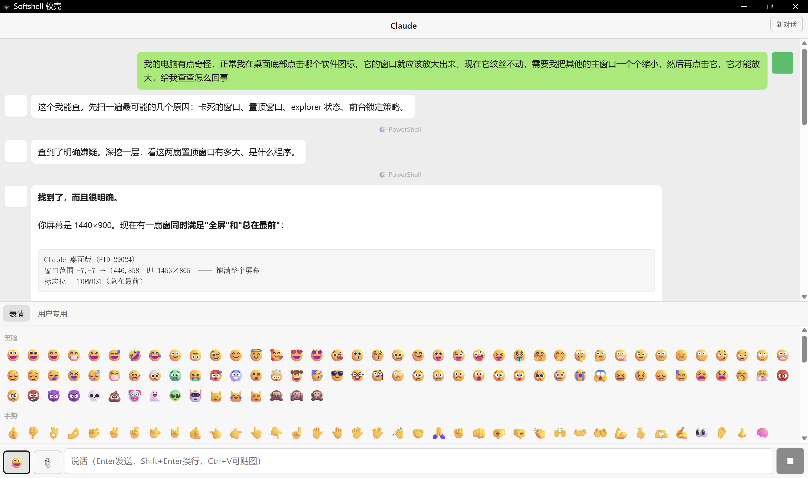

# Softshell 软壳

**给你付费订阅的 Claude 一个聊天软件风格的沟通界面。**

**A chat-app style interface for the Claude subscription you already pay for.**
Runs on the Claude Code CLI. No Claude desktop app, no admin rights, no virtualization.

---



## 这是什么

一个在你自己电脑上跑的聊天窗口。你打字，它调用你本机的 Claude Code CLI，回复以聊天气泡的形式显示出来。**又能聊天，又能直接干活。**

- **界面全中文**，像用聊天软件一样
- **能发图**：点回形针选图，或直接 `Ctrl+V` 粘贴截图
- **表情包**：往 `stickers/` 里丢图，AI 会自己挑合适的发给你；找不到合适的，它会开口跟你要
- **随时打断**：运行中点 ■ 或按 `Esc`，立刻停下，不再消耗额度
- **记忆归你管**：跟 Claude Code CLI 共用同一份本地记忆文件，你能看、能改、能删；会话记录、表情包也全在你自己硬盘上

## 它不需要什么

- 不需要装 Claude 桌面应用
- 不需要管理员权限
- 不需要开启 Virtual Machine Platform 或 Hyper-V
- 不需要特定订阅档位——只要你的 `claude` 命令能跑就行（订阅、API key、云厂商、网关都算）
- 不需要联网到本工具的任何服务器（因为没有）

## ⚠️ 装之前先知道：本产品移除了权限刹车

Claude 桌面版在任务进行中会要求授权各种操作权限。**Softshell 移除了这道刹车。**

原因很实际：它问得太频繁，没人回答它就自己停在那里不接着干。

所以在 Softshell 里，Claude 会直接在你机器上跑各种命令，不再问你。运行中点 ■ 或按 `Esc` 可以随时打断。

如果你是每次Claude问你要授权，你100%允许的，你适合本产品；如果你要认真审批它的请求的，不要下载此产品。

（带权限确认的版本在计划中。）

## 软壳的刹车装在 MEMORY.md 里

移除弹窗授权，不等于放任 Claude 乱跑。软壳的控制方式是另一种：仓库里带了一份 `MEMORY.md`，内容是一套「回合协议」。放进你的记忆文件后，Claude 每个任务都按这个规矩来——

1. **开工先厘定任务**：先把你的意思读清楚，读不准就问，不许拿猜测开工——避免它在错误的理解上推理，白烧 token；
2. **动手前先报计划**：它打算怎么干、要派哪些 subagent，先说出来，你确认了才开始——你永远知道它接下来要干什么；
3. **撞墙必须停下报告**：发现实际情况跟预期对不上，立刻停下来告诉你哪里不对，等你裁决——不许在错误方向上死磕着想办法，把 token 烧在死路上。

这种刹车跟 Claude 桌面版的弹窗授权**完全不是一回事**：弹窗授权是安全刹车，防的是它删错文件、跑错命令；MEMORY.md 是效率刹车，防的是它白干活、烧冤枉钱。**如果你需要的是前面那种安全，请不要下载本产品。**

**怎么装**：把仓库里 `MEMORY.md` 的内容合并进你机器上的这个文件——`C:\Users\<你的用户名>\.claude\projects\C--Users-<你的用户名>\memory\MEMORY.md`（Claude Code CLI 的默认记忆位置，软壳与它共用同一份）；如果这个文件还不存在，直接把它复制过去。软壳不会自动帮你装——你电脑上可能已经有自己的记忆文件，软壳不动你的东西。

## 安装

**前置条件：**[Python 3.8+](https://www.python.org/downloads/)（安装时勾选 *Add to PATH*）和 [Claude Code CLI](https://code.claude.com/docs/en/quickstart)，并且 `claude` 命令能正常登录使用。

**免费 Claude 账户用不了本产品**——这是 Claude Code CLI 本身的限制，不是 Softshell 的。你需要 Pro / Max / Team / Enterprise 订阅，或者 Claude Console 的 API 额度。

Softshell **不捆绑 Claude Code CLI**，你需要自己安装它、用自己的账号登录。

```bash
git clone https://github.com/mckeygilham618-hub/softshell.git
cd softshell
python bridge.py
```

跑起来会自动弹出聊天窗口。之后想再开，双击 `bridge.py` 即可，也可以自己建个快捷方式放桌面。

> Windows 上如果不想每次弹出黑色控制台窗口，用 `pythonw.exe bridge.py` 代替 `python bridge.py`。

## 用法

**表情包**：`stickers/` 下面每个子文件夹是面板里的一个页签，文件夹名就是页签名。往里丢图片就行，不用重启，关掉面板再点开就有了。

**文件名就是标签** —— AI 靠文件名判断该发哪张，所以名字起得越清楚越准。建议用「情绪-动作」的写法：

```
stickers/用户专用/开心-举手欢呼.png
stickers/用户专用/无奈-扶额.jpg
```

嫌一张张改名麻烦？可以让 Claude 自己读图重命名——这个工具本身就能干这活。

**头像和聊天背景**：默认是白方块（Claude）、绿方块（你）、素色背景。想换，把图丢进表情包文件夹，然后直接跟 Claude 说「把你的头像换成XX」「把聊天背景换成XX」——它自己会弄，你也可以让它把自己的头像挑了。顺便，表情包批量改名也可以一起叫它干。

**新对话**：点右上角「新对话」。

## 合规声明

- 本工具使用**你自己的** Claude 账号与额度。不代理、不中转、不代付，不收集或存储任何账号凭证。
- 不修改 Claude Code 的任何文件，只是调用它。
- 不绕过任何地区限制或使用条款。
- 所有数据只在你本机与 Anthropic 官方服务之间流动，本工具不上传任何东西到任何服务器。

## 免责

本项目与 Anthropic 无隶属、赞助或背书关系。Claude 和 Claude Code 是 Anthropic, PBC 的商标。

This project is not affiliated with, sponsored by, or endorsed by Anthropic. Claude and Claude Code are trademarks of Anthropic, PBC.

## 许可证

[MIT](LICENSE) © 2026 YAN YAN

## 致谢

本项目由 YAN YAN 设计与主导，代码在 Anthropic 的 Claude 协助下完成（Fable 5、Opus 5）。人机分工见 [AI_USAGE.md](AI_USAGE.md)。
